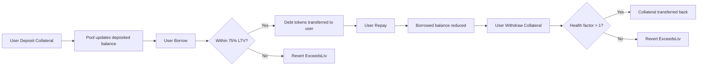

# Lending Pool Workflow Diagram

```mermaid
flowchart LR
    A[User Deposit Collateral] --> B[Pool updates deposited balance]
    B --> C[User Borrow]
    C --> D{Within 75% LTV?}
    D -- Yes --> E[Debt tokens transferred to user]
    D -- No --> F[Revert ExceedsLtv]
    E --> G[User Repay]
    G --> H[Borrowed balance reduced]
    H --> I[User Withdraw Collateral]
    I --> J{Health factor > 1?}
    J -- Yes --> K[Collateral transferred back]
    J -- No --> L[Revert ExceedsLtv]
```
